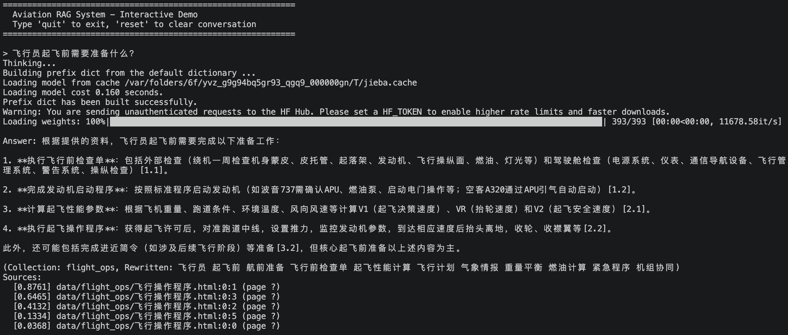

# Aviation RAG — 航空垂直领域大模型 RAG 系统

面向航空教学的检索增强生成系统，支持飞机构造、飞行操作、法规规章三大知识域的智能问答。

## 🏗️ 架构

```
原始文档 → 多格式加载 → 语义分块 → 向量存储(Chroma)
用户问题 → 查询改写 → 领域路由 → 混合检索(BM25+向量) → 重排 → LLM生成 → 答案+溯源
```

## 📁 项目结构

```
aviation-rag/
├── config/             # 配置（.env → Settings）
├── embeddings/         # DashScope text-embedding-v4
├── ingestion/          # 文档加载、OCR、语义分块、元数据增强
├── storage/            # Chroma 多collection管理、建库CLI
├── retrieval/          # 检索：BM25、向量、混合(RRF)、重排、查询改写、路由
├── generation/         # LLM(DeepSeek)、提示词模板、RAG生成器
├── conversation/       # 对话历史、多轮引擎
├── agent/              # 领域智能体（结构/飞行/法规）
├── evaluation/         # 测试用例、LLM裁判、检索/生成指标
├── data/               # 原始文档（按域分目录）
├── scripts/            # 构建脚本、交互demo
└── tests/              # 单元测试
```

## 🚀 快速开始

### 1. 安装依赖

**Python ≥ 3.10 版本**（开发环境为 Python 3.10.20）

```bash
pip install -r requirements.txt
```

首次运行时，BGE 重排序模型（约 1.5GB）会自动下载到 `~/.cache/huggingface/`，仅需一次。

### 2. 配置 API 密钥

本项目需要两个 API 密钥：DeepSeek（大模型问答）和 DashScope（向量嵌入）。

**申请地址：**

| 用途 | 申请地址 | 模型 | 费用 |
|------|---------|------|------|
| Chat 大模型 | [platform.deepseek.com](https://platform.deepseek.com) → API Keys | `deepseek-v4-flash` | 极低，约 ￥0.1/百万 token |
| Embedding 向量化 | [dashscope.aliyun.com](https://dashscope.aliyun.com) → 模型服务 → text-embedding-v4 | `text-embedding-v4` | 约 ￥0.7/百万 token |

**配置步骤：**

```bash
cp .env.example .env
```

然后编辑 `.env` 文件，替换两处占位符：

```bash
# 编辑前（.env.example 模板）
DEEPSEEK_API_KEY=your-deepseek-api-key-here
DASHSCOPE_API_KEY=your-dashscope-api-key-here

# 编辑后（填入你的真实密钥）
DEEPSEEK_API_KEY=sk-你的deepseek密钥
DASHSCOPE_API_KEY=sk-ws-你的dashscope密钥
```

其余配置项有默认值，一般无需修改。

### 3. 准备数据

将航空资料放入对应子目录，支持 **PDF / DOCX / HTML / 图片** 四种格式：

```
data/
├── aircraft_structure/   ← 飞机构造（教材、手册、图纸）
├── flight_ops/           ← 飞行操作（检查单、程序手册）
└── regulations/          ← 法规规章（适航标准、执照规定）
```

项目已自带三份中文航空教育示例文档，可直接使用。

### 4. 构建知识库

```bash
bash scripts/build_all.sh
```

这会依次处理三个领域的所有文档：加载 → 元数据标注 → 语义分块 → 向量嵌入 → 存入 Chroma。

首次构建后会输出每个库的 chunk 数量。后续添加新文档后重新运行即可增量更新（已存在的 chunk 不会重复入库）。如需强制重建，加 `--reset`：

```bash
python -m storage.populate --collection aircraft_structure --source-dir data/aircraft_structure --reset
```

### 5. 交互问答

```bash
python scripts/demo.py
```

启动后进入交互命令行：

```
============================================================
  Aviation RAG System - Interactive Demo
  Type 'quit' to exit, 'reset' to clear conversation
============================================================

> 波音737的襟翼最大偏转角度是多少？
Thinking...
Answer: 波音737采用三缝富勒襟翼，最大偏转角度为40度 [1.3.1]。
(Collection: aircraft_structure, Rewritten: 波音737 襟翼 最大偏转角度 技术规范)
Sources:
  [0.0521] data/aircraft_structure/飞机构造基础.html:3:1 (page ?)
  ...
```

**交互命令：**

| 输入 | 作用 |
|------|------|
| 直接输入问题 | 发起一次 RAG 问答（支持中文） |
| 继续追问 | 自动识别代词（"它""这个"），携带前文上下文 |
| `reset` | 清除对话历史，开始新话题 |
| `quit` 或 `Ctrl+C` | 退出 |

**输出字段说明：**

| 字段 | 含义 |
|------|------|
| `Answer` | 基于检索到的上下文生成的回答，方括号内为引用编号 |
| `Collection` | 问题被自动路由到的知识库（aircraft_structure / flight_ops / regulations） |
| `Rewritten` | 查询改写后的关键词版本（口语→规范术语） |
| `Sources` | 检索到的 top-5 文档片段，含 ID 和相关性分数 |

### 6. 运行评估

```bash
pytest evaluation/test_e2e.py -v
```

包含 20 道航空领域测试题，从三个维度打分（1-5）：

| 维度 | 说明 |
|------|------|
| Faithfulness | 回答是否忠实于上下文（是否编造） |
| Relevance | 回答是否切题 |
| Correctness | 与标准答案是否语义一致 |

分数 ≥ 3 即为通过。评估过程会调用 LLM API，约消耗 50-80 次请求。

## ⭐ 核心特性

- **多格式支持**：PDF、DOCX、HTML、图片OCR
- **语义分块**：按章节/段落边界切分，保持知识完整性
- **混合检索**：BM25关键词 + 向量语义，RRF融合排序
- **BGE重排**：BAAI/bge-reranker-v2-m3 交叉编码器精排
- **查询改写**：口语→规范术语，代词消解
- **多轮对话**：上下文感知，支持追问
- **多知识库**：飞机构造/飞行操作/法规规章独立管理
- **多维度评估**：Recall@K、MRR、Faithfulness、Relevance、Correctness

## 🔧 技术栈

| 组件 | 选型 |
|------|------|
| LLM | DeepSeek v4-flash |
| Embedding | 阿里云 DashScope text-embedding-v4 |
| 向量数据库 | Chroma |
| 重排序 | BAAI/bge-reranker-v2-m3 |
| 中文分词 | jieba |
| 评估 | LLM-as-Judge (1-5 Likert) |

## 📸 效果展示


